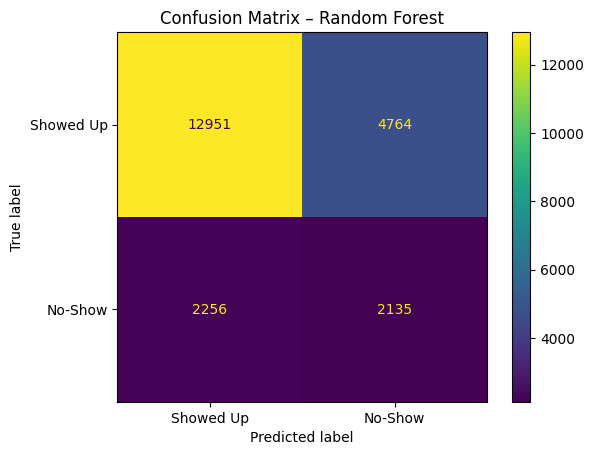
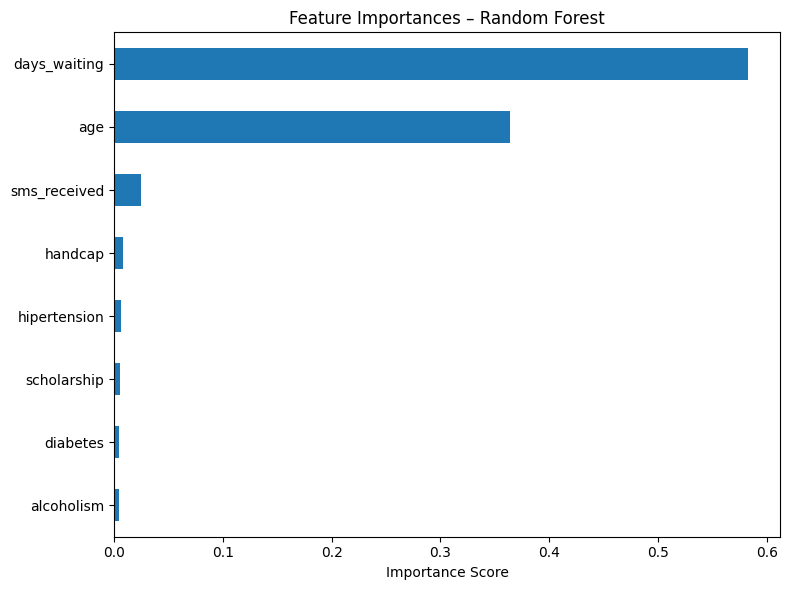

# Patient No-Show Prediction

This project analyzes medical appointment data to predict whether a patient will miss their appointment. It uses logistic regression and random forest models and highlights the business importance of anticipating no-shows in healthcare operations.

## 📊 Dataset

- Source: [Kaggle – No Show Appointments](https://www.kaggle.com/datasets/joniarroba/noshowappointments)
- 100k+ appointments with patient and scheduling data

## 🎯 Objective

To build a predictive model that identifies patients at risk of not showing up, helping clinics optimize scheduling and reduce wasted resources.

## 🛠️ Tools

- Python (Pandas, NumPy, Matplotlib, Seaborn)
- scikit-learn (LogisticRegression, RandomForestClassifier)
- Jupyter Notebook

## 🔍 Key Features Used

- Age  
- Health indicators (Diabetes, Hypertension, Alcoholism, Handicap)  
- SMS Received  
- Days between scheduling and appointment  

## ⚖️ Class Imbalance

- Only ~20% of appointments are no-shows
- Logistic regression performed poorly without rebalancing
- Random Forest + class weights gave the best results

## 📈 Results

| Model | Accuracy | Recall (No-Show) | Precision (No-Show) |
|-------|----------|------------------|----------------------|
| Logistic (baseline) | 80% | 2% | 33% |
| Logistic (balanced) | 66% | 55% | 31% |
| Random Forest       | 68% | 49% | 31% |

## 📊 Visuals

Confusion Matrix (Random Forest):  

Feature Importances (Random Forest):  

## 💡 Key Learnings

- Class imbalance drastically impacts model effectiveness
- Logistic regression is interpretable, but not always optimal
- Random Forest gives better results for this use case
- Operational decisions require balancing false positives and negatives
